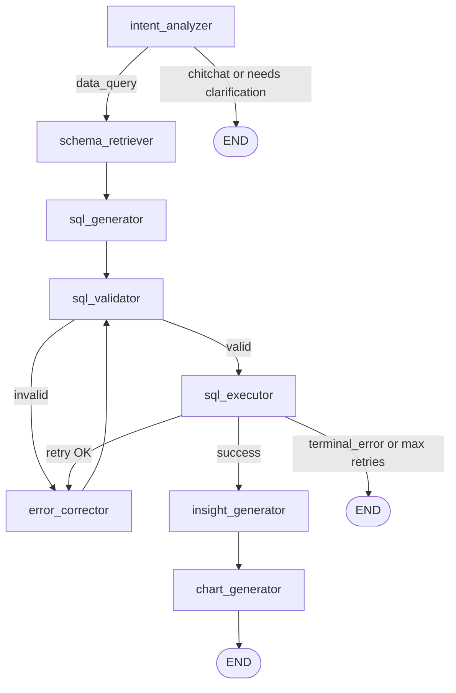
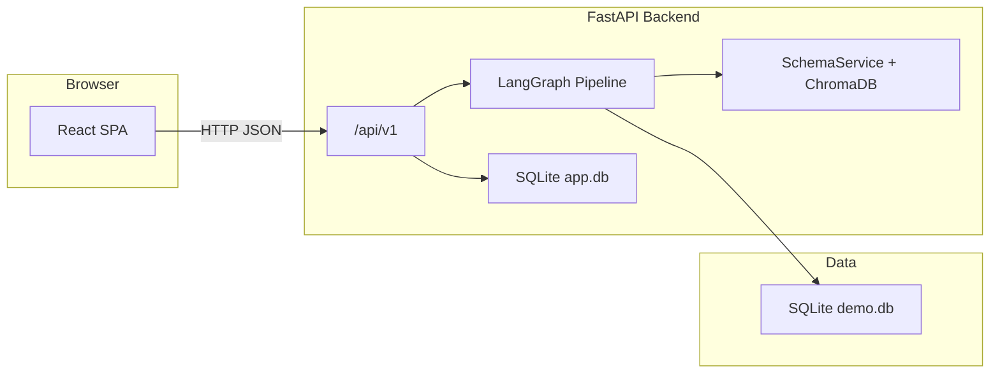

<div align="center">

# Autonomous Business Intelligence Agent

**Ask business questions in plain English. Get validated SQL, row-level results, narrative insights, and charts—with a full execution trace.**

[](https://fastapi.tiangolo.com/)
[](https://langchain-ai.github.io/langgraph/)
[](https://groq.com/)
[](https://react.dev/)
[](https://vitejs.dev/)
[](https://www.docker.com/)
[](https://www.sqlite.org/)
[](LICENSE)

[Features](#project-summary) •
[Architecture](#overall-architecture) •
[LangGraph](#langgraph-workflow) •
[API](#api-endpoints) •
[Setup](#installation--local-setup) •
[Docker](#docker) •
[Evaluation](#evaluation-results) •
[Tests](#integration-test-results)

</div>

---

## Project summary

The **BI Agent** is a full-stack demo that turns natural language into **SQLite analytics** against a seeded **retail schema** (`products`, `customers`, `orders`, `order_items`, `sales_targets`). A **LangGraph** pipeline classifies intent, retrieves relevant schema context with **embeddings + ChromaDB**, generates SQL, validates it, runs it safely, and optionally **self-corrects** on failure up to `MAX_RETRIES` (default **3**). Successful runs produce **structured insights** and a **Recharts**-ready `chart_config`, while every step is recorded in a **trace** for transparency.

| Capability | Implementation |
|------------|------------------|
| Orchestration | `StateGraph` with conditional edges (`backend/agents/graph.py`) |
| LLM | **Groq** via `langchain-groq` (`llama-3.3-70b-versatile` by default) |
| Schema retrieval | **SentenceTransformers** `all-MiniLM-L6-v2` + **ChromaDB** persistent store |
| App state | **SQLAlchemy** + **SQLite** (`DATABASE_URL`) for sessions, messages, history |
| Analytics data | Separate **demo SQLite** (`DEMO_DB_URL`)—read path used by execution layer |
| Frontend | **React 19** + **Vite 8**, **Tailwind CSS**, **Zustand**, **Axios**, **Recharts** |

> **Portfolio note:** Hosted deployments (e.g. Vercel + Render) require env configuration for API keys and CORS. See repo files `render.yaml`, `frontend/vercel.json`, and `backend/.env.production.example` for the intended production layout.

---

## Demo video

## 🎥 Demo Video

Watch the complete walkthrough of the BI-Agent project, including:
- LangGraph workflow
- Natural language to SQL
- Analytics generation
- SQL validation + retries
- Charts and insights
- Integration testing
- Full-stack architecture

👉 [Watch Full Demo](https://drive.google.com/file/d/1o9Vm8xul_kreLAoVjeoB5tWNUFR6xGhc/view?usp=drivesdk)

---

## Screenshots

| Chat & results | Trace panel |
|----------------|-------------|
| _[Add screenshot: main chat + SQL + chart]_ | _[Add screenshot: trace / step timeline]_ |

---

## Tech stack (and why)

| Layer | Choice | Rationale in this repo |
|-------|--------|-------------------------|
| **API** | **FastAPI** | Async-friendly, OpenAPI docs at `/docs`, fits LLM + I/O-bound workflows. |
| **Agent runtime** | **LangGraph** | Explicit **state machine**: routing, retries, and traceability without ad-hoc `if` chains. |
| **LLM provider** | **Groq** (`langchain-groq`) | Fast inference for multi-node graphs; model configurable via `LLM_MODEL`. |
| **Schema RAG** | **ChromaDB** + **SentenceTransformers** | Embeds table/column text for **semantic schema retrieval** before SQL generation. |
| **Metadata / chat** | **SQLAlchemy** + **SQLite** | Lightweight persistence for sessions, messages, and query history—no external DB required for local demo. |
| **SQL safety** | **sqlparse** + validator node | Validates generated SQL before execution (see `sql_validator_node`). |
| **Frontend** | **React** + **Vite** | Fast dev UX; `import.meta.env.VITE_API_BASE_URL` for env-specific API hosts. |
| **State/UI** | **Zustand** | Minimal boilerplate global state for chat and sessions. |
| **Charts** | **Recharts** | Consumes backend `chart_config` for visualization. |
| **Containers** | **Docker Compose** | One command to run backend + frontend with mounted demo DB and Chroma volume. |

---

## LangGraph workflow

The compiled graph **`bi_agent_graph`** lives in [`backend/agents/graph.py`](backend/agents/graph.py). Shared state is a **`TypedDict`** [`AgentState`](backend/agents/state.py) carrying the user query, session id, intent, schema snippet, SQL, validation flags, retries, rows, insights, chart config, and per-node **trace** entries.

### Node sequence (conceptual)



### Routing logic (as implemented)

- **After `intent_analyzer`:**  
  If `intent` is **`chitchat`** or **`needs_clarification`** is true → **END**.  
  Else → **`schema_retriever`**.

- **After `sql_validator`:**  
  If `sql_is_valid` → **`sql_executor`**.  
  Else → **`error_corrector`**.

- **After `sql_executor`:**  
  If **`success`** → **`insight_generator`**.  
  If **`terminal_error`** → **END**.  
  If **`retry_count` ≥ `settings.max_retries`** → **END**.  
  Else → **`error_corrector`**.

- **After `error_corrector`:**  
  If **`terminal_error`** → **END**.  
  Else → back to **`sql_validator`**.

- **Fixed edges:**  
  `schema_retriever` → `sql_generator`; `sql_generator` → `sql_validator`;  
  `insight_generator` → `chart_generator` → **END**.

At import time, the module runs **routing assertions** on synthetic state to guard against regressions in conditional edges.

**Public entry:** `run_agent(user_query, session_id, conversation_history)` invokes the compiled graph and returns the final **`AgentState`**.

---

## Overall architecture

### System view


- **Frontend** talks to **`/api/v1`** using Axios; base URL defaults to `http://localhost:8000/api/v1` or `VITE_API_BASE_URL`.
- **Application DB** (`DATABASE_URL`) stores conversational and operational metadata (see SQLAlchemy models under `backend/db/`).
- **Demo DB** (`DEMO_DB_URL`) holds **read-only analytic** tables used when executing user queries.
- On startup (`lifespan` in [`backend/main.py`](backend/main.py)): ensure metadata, **`schema_service.embed_schema()`** refreshes embeddings for retrieval, optional session cleanup runs.

Detailed request/response for the primary chat endpoint is summarized in [`docs/API_CONTRACT.md`](docs/API_CONTRACT.md).

---

## API endpoints

Base path for versioned routers: **`/api/v1`**.

| Method | Path | Purpose |
|--------|------|---------|
| `GET` | `/` | Root health-ish payload: `{"status":"ok","message":"BI Agent API"}`. |
| `GET` | `/health` | Liveness payload for containers (see `backend/Dockerfile` healthcheck). |
| `GET` | `/api/v1/schema/` | Serialized schema/overview for the UI (tables dict per implementation). |
| `GET` | `/api/v1/sessions/` | List chat sessions with metadata (`session_id`, `session_name`, counts, timestamps). |
| `POST` | `/api/v1/sessions/` | Body: `{"session_name": "<string>"}` → creates session; returns session object. |
| `GET` | `/api/v1/sessions/{session_id}/messages` | Messages plus optional **`result`** attachment per assistant message. |
| `PATCH` | `/api/v1/sessions/{session_id}` | Body: `{"session_name": "<non-blank>"}` → rename. |
| `DELETE` | `/api/v1/sessions/{session_id}` | Delete session (cascade per CRUD implementation). |
| `DELETE` | `/api/v1/sessions/clear-all` | Clear all sessions. |
| `POST` | `/api/v1/sessions/cleanup-garbage` | Remove empty garbage sessions. |
| `POST` | `/api/v1/chat/query` | **Main agent:** body matches [`docs/API_CONTRACT.md`](docs/API_CONTRACT.md)—`user_query`, optional `session_id`. |
| `GET` | `/api/v1/history/?session_id=...&limit=20` | Query history rows for the session. |
| `GET` | `/api/v1/traces/{query_id}` | Stored trace records for one query execution. |

**Interactive docs:** With the backend running, open **`http://localhost:8000/docs`**.

---

## Installation & local setup

### Prerequisites

- **Python 3.11+** (matches `backend/Dockerfile`)
- **Node.js** (for Vite frontend; lockfile tracks exact npm versions)
- **Groq API key** (`GROQ_API_KEY`)

### Backend

1. Copy environment template:

   ```bash
   cp backend/.env.example backend/.env
   ```

2. Set `GROQ_API_KEY` and paths in `backend/.env` per your machine (defaults target local SQLite demo data under `backend/db/demo_data/` where applicable).

3. Install deps and initialize DB (**Makefile shortcut**):

   ```bash
   make setup
   ```

   Equivalent manual steps:

   ```bash
   cd backend && pip install -r requirements.txt && python db/init_db.py
   ```

4. Run API:

   ```bash
   make dev-back
   ```

   Equivalent: `cd backend && uvicorn main:app --reload --port 8000`

### Frontend

```bash
cd frontend
npm install
npm run dev
```

Ensure `frontend/.env.development` sets `VITE_API_BASE_URL=http://localhost:8000/api/v1` (or omit to use the code fallback).

---

## Docker

**Compose file:** [`docker-compose.yml`](docker-compose.yml)

```bash
make docker
# or:
docker-compose up --build
```

| Service | Port | Notes |
|---------|------|-------|
| `backend` | **8000** | Loads `./backend/.env`; mounts `./backend/db/demo_data` and `./backend/chroma_store` for persistence. |
| `frontend` | **3000** → container **80** | Static nginx-style image build per `frontend/Dockerfile`; depends on `backend`. |

**Render (optional):** [`render.yaml`](render.yaml) describes a Docker web service (`bi-agent-backend`) with **`/health`** check path. Persist SQLite/Chroma on the host per your hosting plan (disk/volume)—see comments in `render.yaml`.

---

## Evaluation results

The harness **`backend/evals/run_eval.py`** loads **`backend/evals/benchmark_queries.json`** (currently **25** benchmark rows), runs **`run_agent`** per query against a fixed eval session label, checks table/keyword/row expectations, aggregates latency and retry stats, and writes JSON under **`backend/evals/eval_results/`**.

**Run locally:**

```bash
make eval
# equivalent:
cd backend && python evals/run_eval.py --run-name latest
```

**Committed snapshots (examples—results vary by model/API latency and non-determinism):**

| Run file | Pass rate | Pass % | Avg latency (ms) | Zero-retry % |
|----------|-----------|--------|------------------|--------------|
| `eval_results/baseline_v1_2026-05-15.json` | 11/25 | 44.0 | 3142.76 | 60.0 |
| `eval_results/my_baseline_2026-05-15.json` | 22/25 | 88.0 | 4871.6 | 100.0 |

Use these as **sanity baselines**, not guarantees; re-run `run_eval.py` after prompt or graph changes.

---

## Integration test results

**Script:** [`backend/tests/test_integration.py`](backend/tests/test_integration.py) (plain **httpx** client, **not** pytest—invoked via `make test`).

**Requirement:** Backend reachable at **`http://localhost:8000`** (e.g. `make dev-back` or Docker).

**Checks (8):**

1. `GET /` → `status == "ok"`
2. `GET /api/v1/schema/` → `tables` dict length ≥ 5
3. `POST /api/v1/sessions/` → non-empty `session_id`
4. `POST /api/v1/chat/query` (data question) → `success`, row count, SQL, trace length ≥ 4
5. `GET /api/v1/history/` → non-empty list
6. `GET /api/v1/traces/{query_id}` → list length ≥ 4
7. Chitchat query → `intent == "chitchat"`, empty `generated_sql`
8. Second data query → success, trace depth, history length ≥ 3

**Run:**

```bash
make test
```

Exit code **1** if any step fails (prints ✅/❌ per step and `passed/total` summary).

---

## Example business analytics queries

Drawn from the benchmark file and demo schema—you can paste these into the chat UI:

| Theme | Example question |
|-------|-------------------|
| **Aggregation** | *"How many orders in the database are marked as completed?"* |
| **Aggregation** | *"What is the average dollar amount of an order using the stored order totals?"* |
| **Group-by** | *"Break down how many orders we have in each fulfillment status."* |
| **Group-by** | *"How many loyalty members do we have in each geographic region?"* |
| **Inventory / products** | *"What is the total on-hand inventory quantity summed up for each merchandise category?"* |
| **Line items** | *"Across every line item we have ever sold, what is the total number of units shipped?"* |

Benchmark IDs **`eval_001`–`eval_025`** in `benchmark_queries.json` expand coverage (joins, filters, difficulty tags).

---

## Future improvements

- **Auth / multi-tenancy:** Session isolation and secrets handling for shared deployments.
- **Production DB:** Move from SQLite files to Postgres (or warehouse) with connection pooling and migrations.
- **Stricter guardrails:** Read-only demo DB enforcement, LIMIT defaults, disallow-list for DDL/DML patterns.
- **Eval hardening:** Golden SQL diffing, semantic judges, CI gate on `run_eval.py` threshold.
- **Observability:** Structured logging, trace export (OpenTelemetry), cost/latency dashboards per node.
- **Frontend:** Session recovery UX, streaming partial trace, accessibility pass on chart + trace panels.

---

## Repository structure

```text
bi-agent/
├── README.md
├── Makefile
├── docker-compose.yml
├── render.yaml
├── docs/
│   └── API_CONTRACT.md
├── backend/
│   ├── main.py
│   ├── config.py
│   ├── dependencies.py
│   ├── Dockerfile
│   ├── requirements.txt
│   ├── agents/
│   │   ├── graph.py
│   │   ├── state.py
│   │   └── nodes/          # intent, schema, SQL, validation, execution, correction, insights, charts
│   ├── api/                  # chat, sessions, history, traces, schema
│   ├── db/                   # models, crud, init_db, demo_data (schema.sql, seed_data.sql, demo.db)
│   ├── evals/                # run_eval.py, benchmark_queries.json, eval_results/
│   ├── prompts/
│   ├── services/             # schema (Chroma), trace, memory
│   ├── tests/                # test_integration.py, pytest unit tests
│   └── utils/
└── frontend/
    ├── package.json
    ├── vite.config.js
    ├── vercel.json
    ├── src/
    │   ├── api/
    │   ├── components/       # chat, results, trace, layout
    │   ├── pages/
    │   └── store/
    └── public/
```

---

## Author

**Varun Chikoti** ([@Varun0818](https://github.com/Varun0818))

_Portfolio / interview builds welcome—please attribute if you fork._

---

## License

MIT License

Copyright (c) 2026 Varun Chikoti

Permission is hereby granted, free of charge, to any person obtaining a copy
of this software and associated documentation files (the "Software"), to deal
in the Software without restriction, including without limitation the rights
to use, copy, modify, merge, publish, distribute, sublicense, and/or sell
copies of the Software, and to permit persons to whom the Software is
furnished to do so, subject to the following conditions:

The above copyright notice and this permission notice shall be included in all
copies or substantial portions of the Software.

THE SOFTWARE IS PROVIDED "AS IS", WITHOUT WARRANTY OF ANY KIND, EXPRESS OR
IMPLIED, INCLUDING BUT NOT LIMITED TO THE WARRANTIES OF MERCHANTABILITY,
FITNESS FOR A PARTICULAR PURPOSE AND NONINFRINGEMENT. IN NO EVENT SHALL THE
AUTHORS OR COPYRIGHT HOLDERS BE LIABLE FOR ANY CLAIM, DAMAGES OR OTHER
LIABILITY, WHETHER IN AN ACTION OF CONTRACT, TORT OR OTHERWISE, ARISING FROM,
OUT OF OR IN CONNECTION WITH THE SOFTWARE OR THE USE OR OTHER DEALINGS IN THE
SOFTWARE.
